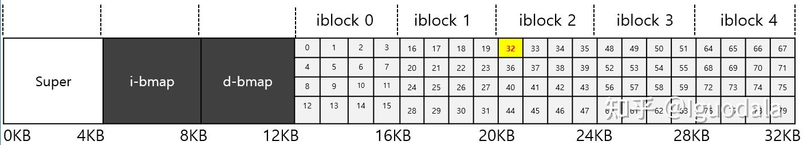

最开始的区域的长度为一个块，其内容是 easy-fs 超级块 (Super Block)，超级块内以魔数的形式提供了文件系统合法性检查功能，同时还可以定位其他连续区域的位置。

第二个区域是一个索引节点位图，长度为若干个块。它记录了后面的索引节点区域中有哪些索引节点已经被分配出去使用了，而哪些还尚未被分配出去。

第三个区域是索引节点区域，长度为若干个块。其中的每个块都存储了若干个索引节点。

第四个区域是一个数据块位图，长度为若干个块。它记录了后面的数据块区域中有哪些数据块已经被分配出去使用了，而哪些还尚未被分配出去。

最后的区域则是数据块区域，顾名思义，其中的每一个已经分配出去的块保存了文件或目录中的具体数据内容。

---


easy-fs 的整体架构自下而上可分为五层
- 块设备接口
- 块缓存
- 磁盘布局及磁盘上数据结构 
- 磁盘块管理器层
- 索引节点，其核心是 Inode 数据结构及其关键成员函数

### 块设备接口

**easy-fs/src/block_dev.rs** 中仅仅是顶一个了一个 trait

```rust
pub trait BlockDevice : Send + Sync + Any {
    fn read_block(&self, block_id: usize, buf: &mut [u8]);
    fn write_block(&self, block_id: usize, buf: &[u8]);
}
```

### 块缓存

**easy-fs/src/block_cache.rs** 中定义了 `BlockCache` 和 `BlockCacheManager`


结构体 `BlockCache` 表示一个块的缓存

```rust
pub struct BlockCache {
    // 创建 BlockCache 实例时从目标块读取数据到 `cache` 中
    cache: [u8; BLOCK_SZ],
    // `block_id` 和 `block_device` 唯一的标识了一个块
    block_id: usize,
    block_device: Arc<dyn BlockDevice>,
    modified: bool,
}
```

BlockCache 提供了一个 `sync` 方法以用于将在缓存中的修改同步到块设备上。

```rust
pub struct BlockCacheManager {
    queue: VecDeque<(usize, Arc<Mutex<BlockCache>>)>,
}
```

`BlockCacheManager` 的缓存淘汰策略是从队列中选择一个最老的，`Arc::strong_count` 为 1 的 `BlockCache` 淘汰。
这里 `Arc::strong_count` 意为没有进程正在使用该缓存块。在我们的实现中，如果找不到的话就直接 `panic` 了。

### 磁盘布局及磁盘上数据结构 

我们设计的极简文件系统的磁盘结构如下图所示



- superblock 记录了该文件系统的特定信息，如文件系统有多少个 inode block 和 data block、inode table 的开始位置、一些标识文件系统类型的幻数等等。

`easy-fs/src/layout.rs` 中定义了 `SuperBlock` 的结构

```rust
pub struct SuperBlock {
    magic: u32,
    pub total_blocks: u32,
    pub inode_bitmap_blocks: u32,
    pub inode_area_blocks: u32,
    pub data_bitmap_blocks: u32,
    pub data_area_blocks: u32,
}
```

- bitmap block 记录了哪些磁盘块是空闲的

`easy-fs/src/bitmap.rs` 中定义了 `BitmapBlock` 和 `Bitmap` 的结构

```rust

struct Bitmap {
    start_block_id: usize,
    blocks: usize,
}

type BitmapBlock = [u64; 64];
```

`Bitmap` 记录了 bitmap block 区域的开始块，和总共有多少块

每个 `BitmapBlock` 都可以看做一个 bit 数组，每一 bit 对应了一个 block 指示其是否已使用

- inode block 记录了每个文件的 metadata

每个 inode block 都可以看作一个包含 struct inode 结构的数组，所以每个 inode 都由一个数字（inumber，即 inode number）隐式引用，只要给定一个 inumber，就可以通过计算得出磁盘上相应 inode 节点的位置。

```rust
pub struct DiskInode {
    pub size: u32,
    // 当文件较小的时候，直接使用 direct 指向目标 data block
    pub direct: [u32; INODE_DIRECT_COUNT],
    // indirect1 指向一个一级索引块。间接指针不指向包含用户数据的块，而是指向包含更多指针
    pub indirect1: u32,
    pub indirect2: u32,
    type_: DiskInodeType,
}

type IndirectBlock = [u32; BLOCK_SZ / 4];
```

- data block 存储了用户数据。

作为一个文件而言，它的内容在文件系统或内核看来没有任何既定的格式，都只是一个字节序列。

```rust
type DataBlock = [u8; BLOCK_SZ];
```

目录的内容基本上就是一个列表，列表中包含一个核心的二元组（条目名称，inode number）。

```rust
struct DirEntry {
    name: [u8; NAME_LENGTH_LIMIT + 1],
    inode_number: u32,
}
```

### 磁盘块管理器 

核心是 EasyFileSystem 数据结构及其关键成员函数

`easy-fs/src/efs.rs` 中定义了 `EasyFileSystem` 的结构

```rust
struct EasyFileSystem {
    pub block_device: Arc<dyn BlockDevice>,
    pub inode_bitmap: Bitmap,
    pub data_bitmap: Bitmap,
    inode_area_start_block: u32,
    data_area_start_block: u32,
}
```

### 索引节点  

索引节点是面向用户的一层，服务于文件相关系统调用。

我们设计索引节点 `Inode` 暴露给文件系统的使用者，让他们能够直接对文件和目录进行操作。`Inode` 是放在内存中的记录文件索引节点信息的数据结构。

`easy-fs/src/vfs.rs` 中定义了 `Inode` 的结构

```rust
pub struct Inode {
    // block_id 和 block_offset 唯一指定了在磁盘上的位置，可得到 DiskInode
    block_id: usize,
    block_offset: usize,
    fs: Arc<Mutex<EasyFileSystem>>,
    block_device: Arc<dyn BlockDevice>,
}
```

我们使用文件系统的第一件事便是获取根目录的 `Inode`，根目录固定由 inode number 0 索引。

---

OS 使用 `EasyFileSystem::open` 打开在硬盘上的文件系统，使用 `EasyFileSystem::root_inode` 从文件系统中获取根目录的 `Inode`。这之后就可以使用 ROOT_INODE 在内核中进行各种操作了。

OS 在 `Inode` 之上又封装了一层 `OSInode`。

```rust
pub struct OSInode {
    readable: bool,
    writable: bool,
    inner: Mutex<OSInodeInner>,
}

pub struct OSInodeInner {
    offset: usize,
    inode: Arc<Inode>,
}
```

OS 通过 `OSInode` 通过 `Inode` 进行各种操作：
- 如果当前 `OSInode` 对应的是文件，则提供读写操作
- 如果当前 `OSInode` 对应的是目录，则提供创建删除和打开文件操作
简单起见我们只有一个目录层级（根目录），其他所有文件平铺在根目录中。

